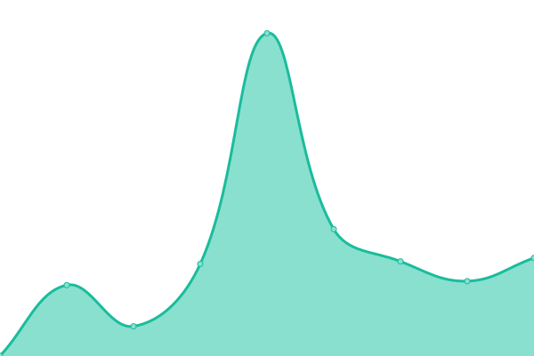
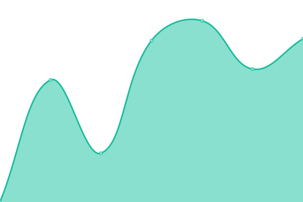

# [📈 Live Status](https://JGAntunes.github.io/uptime): <!--live status--> **🟩 All systems operational**

This repository contains the open-source uptime monitor and status page for [João Antunes](jgantunes.com), powered by [Upptime](https://github.com/upptime/upptime).

With [Upptime](https://upptime.js.org), you can get your own unlimited and free uptime monitor and status page, powered entirely by a GitHub repository. We use [Issues](https://github.com/JGAntunes/uptime/issues) as incident reports, [Actions](https://github.com/JGAntunes/uptime/actions) as uptime monitors, and [Pages](https://JGAntunes.github.io/uptime) for the status page.

<!--start: status pages-->
<!-- This summary is generated by Upptime (https://github.com/upptime/upptime) -->
<!-- Do not edit this manually, your changes will be overwritten -->
<!-- prettier-ignore -->
| URL | Status | History | Response Time | Uptime |
| --- | ------ | ------- | ------------- | ------ |
|  [JGAntunes](https://jgantunes.com) | 🟩 Up | [jg-antunes.yml](https://github.com/JGAntunes/uptime/commits/HEAD/history/jg-antunes.yml) | 

 197ms
     
 | 

<a href="https://JGAntunes.github.io/uptime/history/jg-antunes">100.00%</a>
    

|  [Docerita](https://docerita.com) | 🟩 Up | [docerita.yml](https://github.com/JGAntunes/uptime/commits/HEAD/history/docerita.yml) | 

 775ms
     
 | 

<a href="https://JGAntunes.github.io/uptime/history/docerita">100.00%</a>
    

|  [Docerita WWW](https://www.docerita.com) | 🟩 Up | [docerita-www.yml](https://github.com/JGAntunes/uptime/commits/HEAD/history/docerita-www.yml) | 

 1005ms
     
 | 

<a href="https://JGAntunes.github.io/uptime/history/docerita-www">100.00%</a>
    

|  [Docerita HTTP](http://docerita.com) | 🟩 Up | [docerita-http.yml](https://github.com/JGAntunes/uptime/commits/HEAD/history/docerita-http.yml) | 

 371ms
     
 | 

<a href="https://JGAntunes.github.io/uptime/history/docerita-http">100.00%</a>
    

|  [Docerita Store](https://store.docerita.com/v1/status) | 🟩 Up | [docerita-store.yml](https://github.com/JGAntunes/uptime/commits/HEAD/history/docerita-store.yml) | 

 885ms
     
 | 

<a href="https://JGAntunes.github.io/uptime/history/docerita-store">100.00%</a>
    

|  [Docerita Store Staging](https://store-stg.docerita.com/v1/status) | 🟩 Up | [docerita-store-staging.yml](https://github.com/JGAntunes/uptime/commits/HEAD/history/docerita-store-staging.yml) | 

 726ms
     
 | 

<a href="https://JGAntunes.github.io/uptime/history/docerita-store-staging">100.00%</a>
    

<!--end: status pages-->

[**Visit our status website →**](https://JGAntunes.github.io/uptime)

## 📄 License

- Powered by: [Upptime](https://github.com/upptime/upptime)
- Code: [MIT](./LICENSE) © [João Antunes](jgantunes.com)
- Data in the `./history` directory: [Open Database License](https://opendatacommons.org/licenses/odbl/1-0/)
